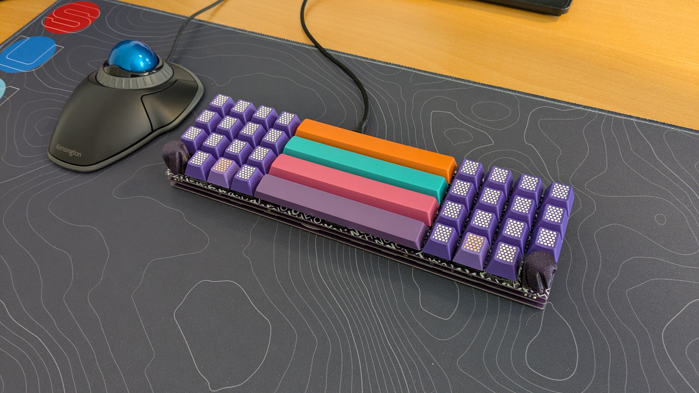

# Another Space

14.25u ortholinear mechanical keyboard with support for up to 4 spacebars, built with PCB, plate and backplate made from FR4.

Untested 15u version is available in [1.5](1.5/).

## Hardware needed
- Pro Micro compatible controller
- 4x Brass stand-offs - 5 mm or longer
- 8x M2 screws - 4 mm
- 4-8 silicone bump-ons eg. 6x2 mm 
- 40-44 SOD-123 diodes
- 40-44 MX switches
- Keycaps

## Firmware
Firmware is available in my [Vial fork](https://github.com/mhzkb/vial-qmk/tree/vial/keyboards/mhzkb) (May need to be size-optimised for non-RP2040 controllers)

